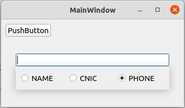

# SearchWidget With Filter

It is working but it is very basic and roughly designed widget. Please refine the code if you want to use it in production.

The popup widget is shown as soon as you click inside the search widget or the search widget gets infocus. You can hide the popup by pressing escape key or clicking anywhere in the application window.

